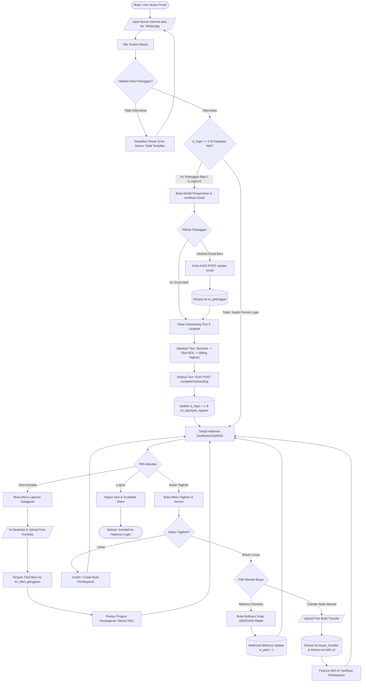
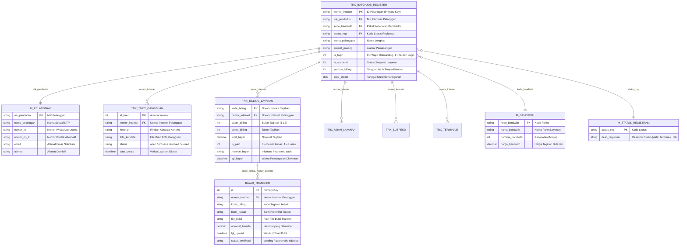
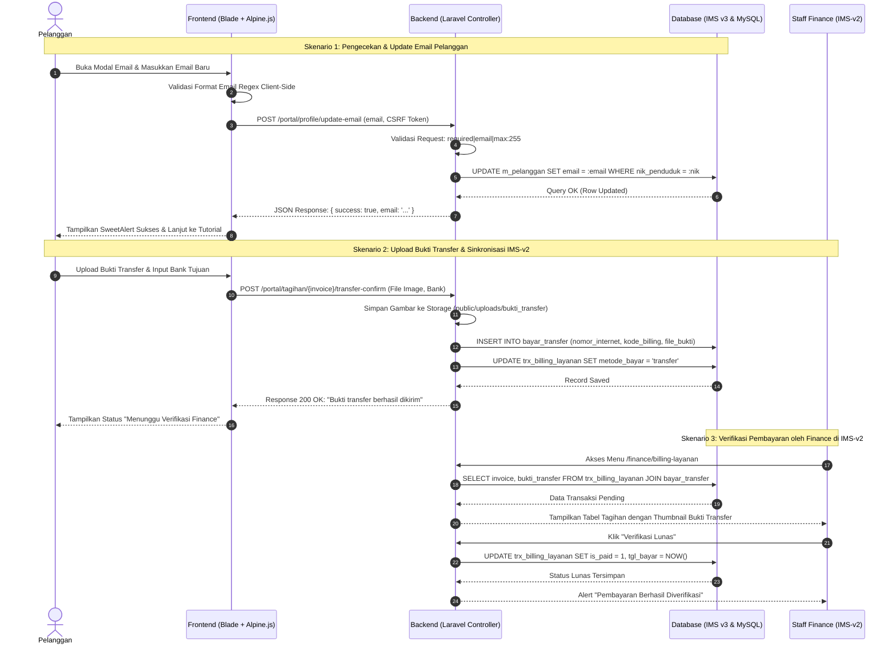
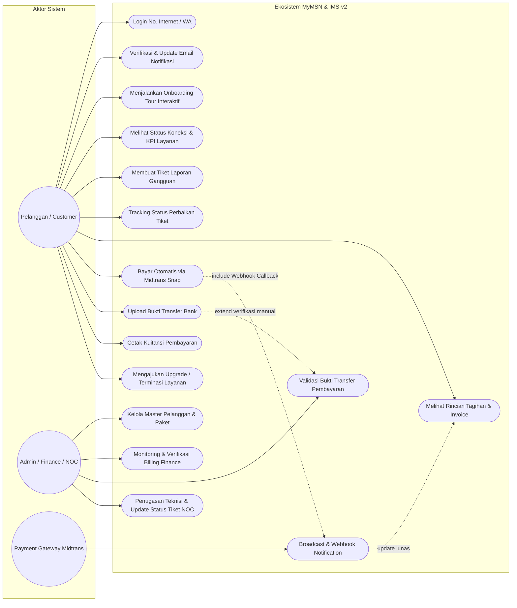
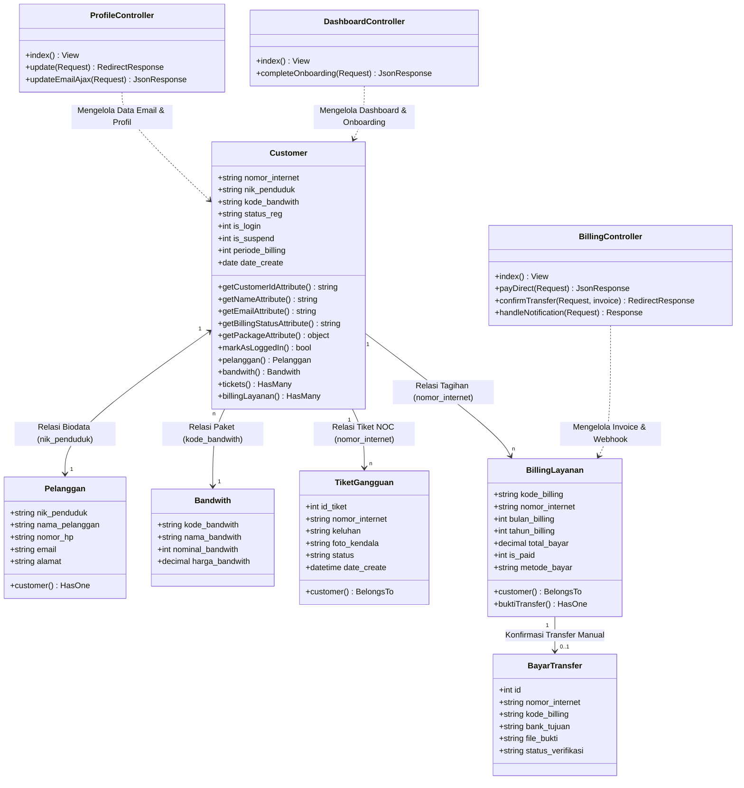

# Dokumentasi Arsitektur & Diagram Sistem
## MyMSN Customer Self-Care Portal (`ptmsn`) & Integrated Management System (`ims_v2`)

Dokumen ini berisi spesifikasi teknis dan visualisasi diagram Mermaid lengkap untuk ekosistem aplikasi **PT Media Solusi Network (PT MSN)**.

---

### Informasi Aplikasi
- **Nama Aplikasi**: MyMSN Customer Self-Care Portal (`ptmsn`) & Integrated Management System (`ims_v2`)
- **Deskripsi**: Ekosistem layanan ISP PT Media Solusi Network yang mencakup portal mandiri pelanggan (Self-Care), manajemen operasional & billing finance (IMS-v2), sistem ticketing gangguan/NOC, dan gateway pembayaran otomatis/transfer bank.
- **Aktor**: 
  1. **Pelanggan (Customer)**: Mengakses dashboard layanan, membuat tiket kendala, membayar tagihan via Midtrans/Transfer Bank, dan memperbarui email notifikasi.
  2. **Admin / Finance / NOC Staff**: Mengelola data pelanggan, memverifikasi bukti transfer, menangani tiket gangguan teknis, dan mengontrol status registrasi/billing di IMS-v2.
  3. **Payment Gateway (Midtrans)**: Memproses transaksi pembayaran otomatis dan mengirim webhook callback status pelunasan.
- **Teknologi**: Laravel 11/12 + Blade + Tailwind CSS + Alpine.js + MySQL / MariaDB (Database `ims_v3` & `mysql`) + Midtrans API.

---

### 1. Flowchart Alur Utama Aplikasi (`flowchart TD`)
Diagram ini memodelkan alur lengkap aplikasi mulai dari user membuka halaman login, validasi autentikasi, pengecekan `is_login` database untuk verifikasi email & onboarding tour, hingga transaksi tagihan dan logout.

---

### 2. Entity Relationship Diagram / ERD (`erDiagram`)
Diagram ini menggambarkan struktur relasi tabel antara database portal pelanggan (`ptmsn`) dan database manajemen IMS (`ims_v3`) beserta kardinalitasnya.

---

### 3. Sequence Diagram: Proses Transaksi & CRUD (`sequenceDiagram`)
Diagram ini memodelkan interaksi step-by-step antar komponen saat pelanggan melakukan **Verifikasi & Update Email** serta proses **Pembayaran Transfer & Sinkronisasi ke IMS-v2**.

---

### 4. Use Case Diagram
Diagram ini memetakan batasan hak akses dan fungsionalitas untuk masing-masing aktor di sistem portal MyMSN dan IMS-v2.

---

### 5. Class Diagram (`classDiagram`)
Diagram ini menyajikan struktur kelas model Eloquent Laravel, Controller, relasi asosiasi, atribut, dan method utamanya.

---

### Asumsi Sistem:
1. **Multi-Database Connection**: Aplikasi `ptmsn` terhubung ke koneksi default `mysql` untuk data umum web/CMS dan koneksi `ims` yang mengarah ke database `ims_v3` (tabel master pelanggan, batchjob registrasi, dan billing).
2. **Autentikasi Customer**: Menggunakan guard `customer` berbasis nomor internet atau nomor WhatsApp terdaftar tanpa memerlukan input password manual demi kemudahan self-care pelanggan.
3. **Mekanisme Onboarding**: Nilai `is_login = 0` menandakan user baru pertama kali masuk sehingga otomatis diarahkan ke alur verifikasi email dan spotlight tour 5 langkah sebelum diupdate menjadi `1`.
